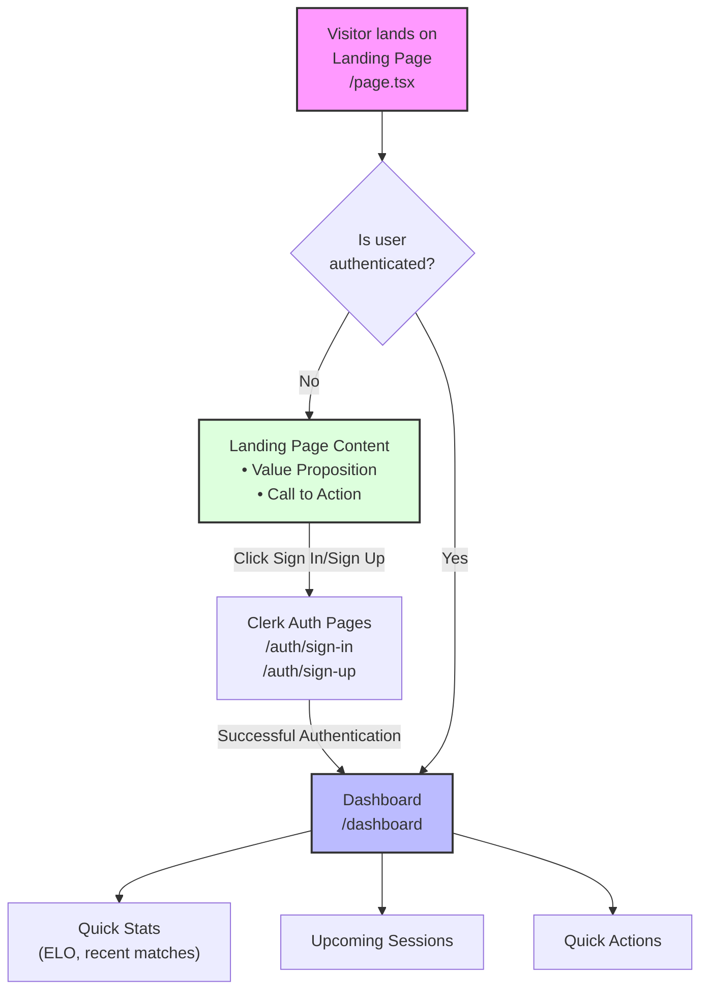

# User Authentication Flow

This document outlines the core user authentication flow for the tennis matchmaking platform.

## Authentication and Landing Page Flow

## Flow Description

1. **Initial Landing**
   - All visitors first see the landing page (`/page.tsx`)
   - Contains value proposition and call-to-action buttons

2. **Authentication Check**
   - Authenticated users are automatically redirected to dashboard
   - Non-authenticated users remain on landing page

3. **Authentication Flow**
   - Sign In/Sign Up buttons direct to Clerk authentication pages
   - Located at `/auth/sign-in` or `/auth/sign-up`

4. **Post-Authentication**
   - Successful authentication leads to dashboard
   - Dashboard displays:
     - Quick Stats
     - Upcoming Sessions
     - Quick Actions

## Implementation Notes

- Landing page should focus on converting visitors to signed-up users
- Dashboard serves as the main hub for authenticated users
- Authentication is handled entirely by Clerk
- All post-authentication pages should be protected routes 