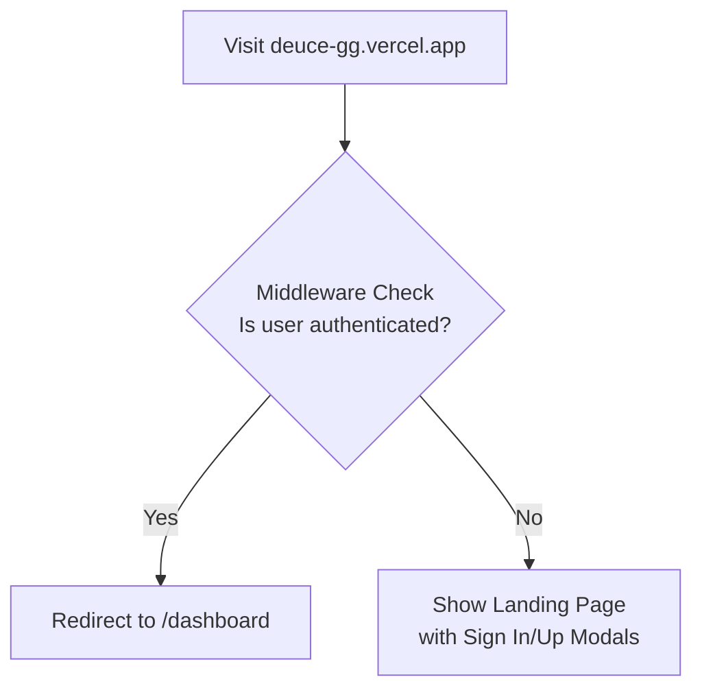
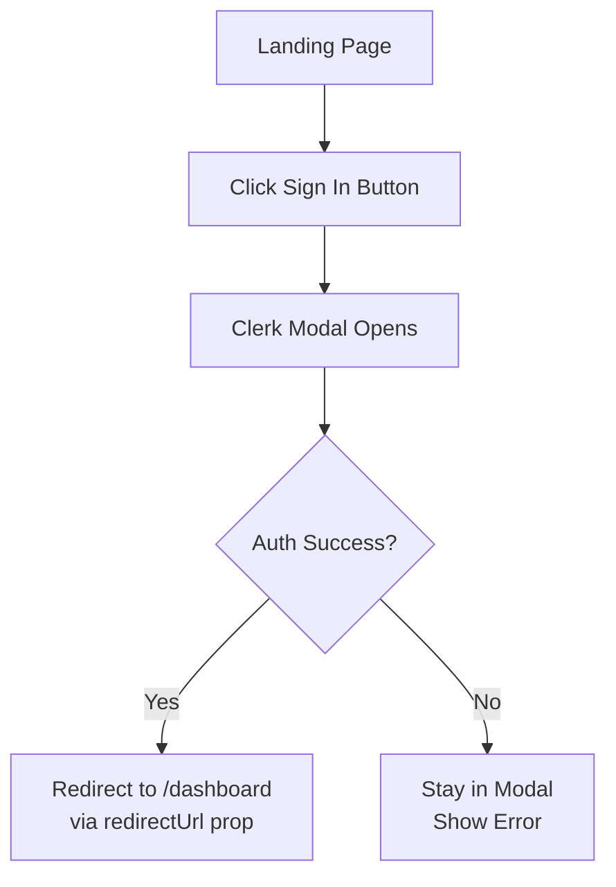
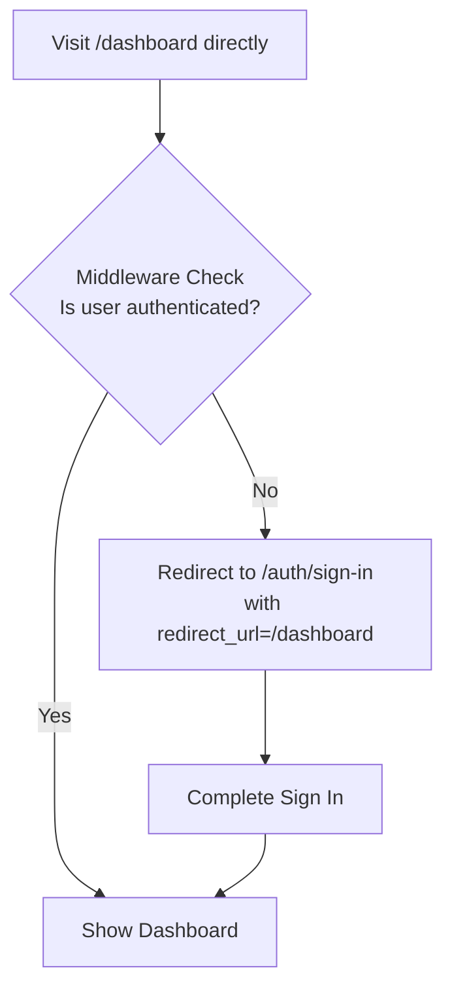

# User Authentication Flow

This document outlines the core user authentication flow for the tennis matchmaking platform.

## Initial Landing Flow



## Authentication Paths

### Path A - Modal Authentication (from Landing)


### Path B - Direct Dashboard Access


## Component Responsibilities

### 1. Middleware (`src/middleware.ts`)
- Protects all routes
- Handles authentication checks
- Manages redirects for unauthenticated users
```typescript
publicRoutes: ["/", "/auth/sign-in", "/auth/sign-up"]
afterAuth(auth, req) {
  // Redirect authenticated users from landing
  if (auth.userId && req.nextUrl.pathname === "/") {
    return NextResponse.redirect(new URL("/dashboard", req.url));
  }

  // Redirect unauthenticated users to sign in
  if (!auth.userId && !req.nextUrl.pathname.startsWith("/auth/")) {
    const signInUrl = new URL("/auth/sign-in", req.url);
    signInUrl.searchParams.set("redirect_url", req.nextUrl.pathname);
    return NextResponse.redirect(signInUrl);
  }
}
```

### 2. Landing Page (`src/app/page.tsx`)
- Entry point for new users
- Provides modal-based authentication
- Contains value proposition and CTAs
```typescript
<SignInButton mode="modal" redirectUrl="/dashboard">
  <button>Sign In</button>
</SignInButton>
```

### 3. Sign In Page (`src/app/auth/sign-in/page.tsx`)
- Handles full-page authentication
- Manages redirect URLs
```typescript
<SignIn 
  redirectUrl={searchParams.redirect_url || "/dashboard"}
  afterSignInUrl={searchParams.redirect_url || "/dashboard"}
  signUpUrl="/auth/sign-up" 
/>
```

### 4. Dashboard Page (`src/app/dashboard/page.tsx`)
- Protected route
- Verifies authentication
- Shows personalized content
```typescript
const { userId } = auth();
const user = await currentUser();

if (!userId || !user) {
  redirect("/auth/sign-in?redirect_url=/dashboard");
}
```

## Authentication Flow Details

1. **First-Time Visit**
   - User lands on `/`
   - Middleware allows access (public route)
   - Shows landing page with auth buttons

2. **Authentication Options**
   - **Modal Flow** (from landing page):
     - Click Sign In → Clerk modal opens
     - Enter credentials
     - Success → Redirect to `/dashboard`
   - **Direct Access Flow**:
     - Visit `/dashboard`
     - Middleware redirects to sign in if needed
     - After auth → Return to dashboard

3. **Post-Authentication**
   - Dashboard performs final auth check
   - Fetches user data
   - Displays personalized content:
     - Quick Stats
     - Upcoming Sessions
     - Quick Actions

## Security Notes

- Multiple layers of protection:
  1. Middleware route protection
  2. Clerk authentication handling
  3. Component-level verification
- Secure redirect handling
- Preserved user intent through auth flow
- Protected routes require valid session 